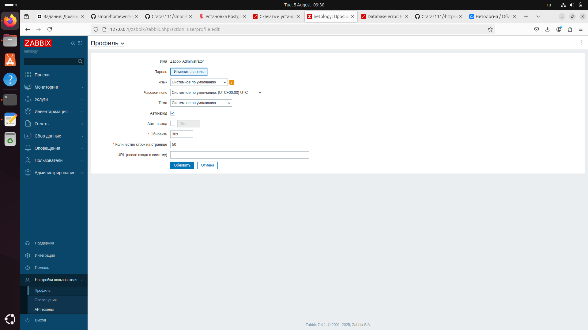

# Домашнее задание к занятию «Система мониторинга Zabbix» - Заруцкий

В практике есть 2 основных и 1 дополнительное (со звездочкой) задания. Первые два нужно выполнять обязательно, третье - по желанию и его решение никак не повлияет на получение вами зачета по этому домашнему заданию, при этом вы сможете глубже и/или шире разобраться в материале.

Пожалуйста, присылайте на проверку всю задачу сразу. Любые вопросы по решению задач задавайте в чате учебной группы.
Цели задания

    Научиться устанавливать Zabbix Server c веб-интерфейсом
    Научиться устанавливать Zabbix Agent на хосты
    Научиться устанавливать Zabbix Agent на компьютер и подключать его к серверу Zabbix

Чеклист готовности к домашнему заданию

    Просмотрите в личном кабинете занятие "Система мониторинга Zabbix"

Инструкция по выполнению домашнего задания

    Сделайте fork репозитория c шаблоном решения к себе в Github и переименуйте его по названию или номеру занятия, например, https://github.com/имя-вашего-репозитория/gitlab-hw или https://github.com/имя-вашего-репозитория/8-03-hw).
    Выполните клонирование этого репозитория к себе на ПК с помощью команды git clone.
    Выполните домашнее задание и заполните у себя локально этот файл README.md:
        впишите вверху название занятия и ваши фамилию и имя;
        в каждом задании добавьте решение в требуемом виде: текст/код/скриншоты/ссылка;
        для корректного добавления скриншотов воспользуйтесь инструкцией «Как вставить скриншот в шаблон с решением»;
        при оформлении используйте возможности языка разметки md. Коротко об этом можно посмотреть в инструкции по MarkDown.
    После завершения работы над домашним заданием сделайте коммит (git commit -m "comment") и отправьте его на Github (git push origin).
    Для проверки домашнего задания преподавателем в личном кабинете прикрепите и отправьте ссылку на решение в виде md-файла в вашем Github.
    Любые вопросы задавайте в чате учебной группы и/или в разделе «Вопросы по заданию» в личном кабинете.

Задание 1

Установите Zabbix Server с веб-интерфейсом.
Процесс выполнения

    Выполняя ДЗ, сверяйтесь с процессом отражённым в записи лекции.
    Установите PostgreSQL. Для установки достаточна та версия, что есть в системном репозитороии Debian 11.
    Пользуясь конфигуратором команд с официального сайта, составьте набор команд для установки последней версии Zabbix с поддержкой PostgreSQL и Apache.
    Выполните все необходимые команды для установки Zabbix Server и Zabbix Web Server.

Требования к результатам

    Прикрепите в файл README.md скриншот авторизации в админке.
    Приложите в файл README.md текст использованных команд в GitHub.

Задание 2

Установите Zabbix Agent на два хоста.
Процесс выполнения

    Выполняя ДЗ, сверяйтесь с процессом отражённым в записи лекции.
    Установите Zabbix Agent на 2 вирт.машины, одной из них может быть ваш Zabbix Server.
    Добавьте Zabbix Server в список разрешенных серверов ваших Zabbix Agentов.
    Добавьте Zabbix Agentов в раздел Configuration > Hosts вашего Zabbix Servera.
    Проверьте, что в разделе Latest Data начали появляться данные с добавленных агентов.

Требования к результатам

    Приложите в файл README.md скриншот раздела Configuration > Hosts, где видно, что агенты подключены к серверу
    Приложите в файл README.md скриншот лога zabbix agent, где видно, что он работает с сервером
    Приложите в файл README.md скриншот раздела Monitoring > Latest data для обоих хостов, где видны поступающие от агентов данные.
    Приложите в файл README.md текст использованных команд в GitHub

Задание 3 со звёздочкой*

Установите Zabbix Agent на Windows (компьютер) и подключите его к серверу Zabbix.
Требования к результатам

    Приложите в файл README.md скриншот раздела Latest Data, где видно свободное место на диске C:

Критерии оценки

    Выполнено минимум 2 обязательных задания
    Прикреплены требуемые скриншоты и тексты
    Задание оформлено в шаблоне с решением и опубликовано на GitHub

**Решения:**
#Задание 1#

Команды GitHub

1. При помощи команды git clone копируем репзиторий с фаилами из задания на виртуальную машину созданную при помощи Vagrant.
2. При помощи команды cd переходим в директорию со скопированными файлами.
3. Командой git add . добавляю все имзменения в коммит.
4. Командой git commit -m hm1 создаю коммит. 
5. Командой git push origin main отправляю изменения в репозиторий

#Задание 2#

